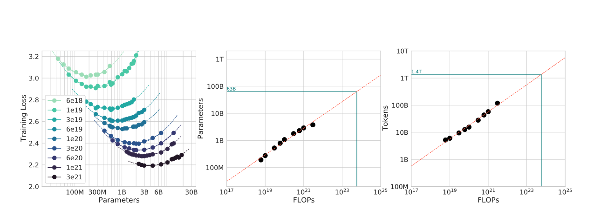
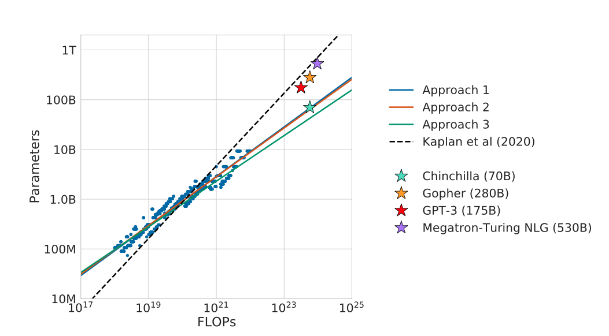
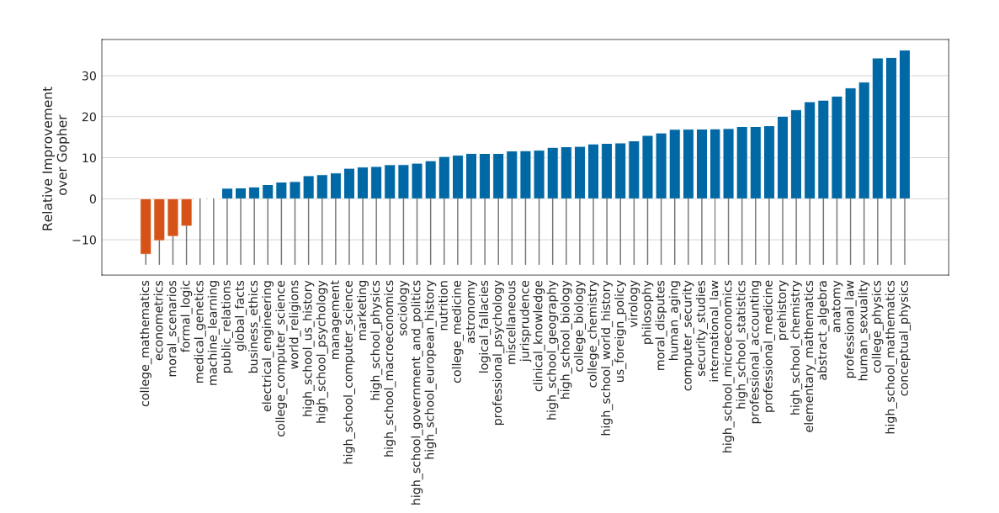
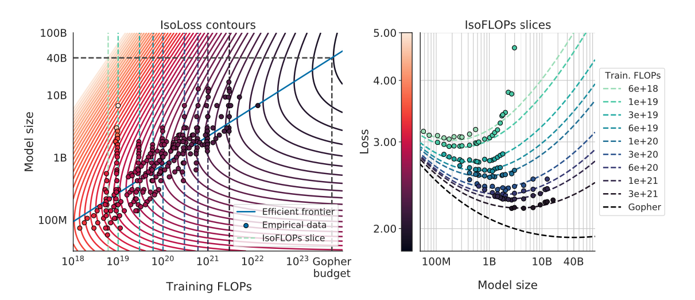

# Training Compute-Optimal Large Language Models (Chinchilla)
**DS 5690 Paper Presentation**

*Authors: Jordan Hoffmann, Sebastian Borgeaud, Arthur Mensch, Elena Buchatskaya, Trevor Cai, Eliza Rutherford, Diego de Las Casas, Lisa Anne Hendricks, Johannes Welbl, Aidan Clark, Tom Hennigan, Eric Noland, Katie Millican, George van den Driessche, Bogdan Damoc, Aurelia Guy, Simon Osindero, Karen Simonyan, Erich Elsen, Jack W. Rae, Oriol Vinyals, Laurent Sifre*

*DeepMind*

*Published: 29 March 2022*

**Presenter :** Dhesel Khando 
___

# Overview

## Context: The Era of "Bigger is Better"

By 2022, AI research followed one clear principle: **bigger models perform better**. The field witnessed explosive growth:
- **GPT-3** (2020): 175B parameters
- **Gopher** (DeepMind, 2021): 280B parameters
- **Megatron-Turing NLG** (2021): 530B parameters

This trend was guided by Kaplan et al.'s (2020) scaling laws, which recommended: **when doubling compute, increase model size 5.5× but only increase training data 1.8×**. This led to ever-larger models trained on relatively fixed datasets (~300B tokens). Gopher alone cost an estimated $6 million to train.

## The Problem: Are We Scaling Wrong?

**Central Question:** Are large language models undertrained relative to their size?

Despite models growing 3× larger, training data remained constant:
- GPT-3 (175B params): ~300B tokens
- Gopher (280B params): ~300B tokens
- MT-NLG (530B params): ~270B tokens

**The Issue:** Kaplan's laws were derived from models trained on ≤22B tokens, yet were being applied to models requiring 100× more compute. If the scaling laws were wrong, the field was:
- Wasting billions on oversized, undertrained models
- Paying unnecessarily high inference costs (bigger models cost more to run)
- Missing achievable performance gains

## The Approach: Systematic Empirical Investigation

DeepMind conducted the largest scaling study to date:

**1. Massive Experimental Sweep**
- **400+ models** trained from 70M to 16B parameters
- Training tokens: 5B to 500B
- Compute range: 6×10¹⁸ to 3×10²¹ FLOPs

**2. Three Independent Validation Methods**

*Approach 1:* Fixed model sizes, varied training tokens → extrapolate optimal duration

*Approach 2:* IsoFLOP profiles → for fixed compute, test different size/data trade-offs

*Approach 3:* Parametric loss fitting → L(N,D) = E + A/N^α + B/D^β


*Figure 3: IsoFLOP profiles showing the compute-optimal frontier.*

**3. Validation at Scale: Chinchilla**
- 70B parameters trained on 1.4T tokens
- Same compute budget as Gopher (280B params, 300B tokens)
- Tested on MMLU, BIG-bench, code generation, mathematical reasoning

## The Discovery: Equal Scaling

**Breakthrough Finding:** Parameters and training data should scale equally.

```
N_opt ∝ C^0.50    (optimal parameters)
D_opt ∝ C^0.49    (optimal tokens)
```

**In practice:** Double compute → double model size AND double training data.

This contradicts Kaplan et al.: they said scale model 5.5×, data 1.8×. Chinchilla says: scale both ~3.2× equally.


*Figure 1: Chinchilla vs. Kaplan scaling predictions.*

**Example: For Gopher's compute budget (5.76×10²³ FLOPs)**
- Kaplan approach: 280B params, 300B tokens
- **Chinchilla approach: 70B params, 1.4T tokens** ✓ (4× smaller, 4.7× more data)

## Results: Smaller Model, Better Performance

Despite being **4× smaller**, Chinchilla outperformed Gopher across all benchmarks:

| Benchmark | Gopher (280B) | Chinchilla (70B) | Gain |
|-----------|---------------|------------------|------|
| MMLU | 60.0% | **67.5%** | +7.5% |
| BIG-bench | 65.2% | **67.6%** | +2.4% |
| HumanEval | 10.3% | **13.1%** | +27% |


*Figure 6: MMLU benchmark comparison.*

**Key Benefits:**
- **Same training cost**, better performance
- **4× lower inference costs** (smaller model to run)
- **4× less memory** required for deployment
- Easier to fine-tune

**The Impact:** Prior models (GPT-3, Gopher) were severely undertrained—they used <25% of optimal training tokens and were 4× too large. By rebalancing compute allocation, Chinchilla achieved better results for the same cost.


*Figure 4: Loss contours showing compute-optimal frontier.*

___

# Questions for Understanding

## Question 1: Why did Kaplan et al.'s scaling laws fail? What methodological issues led to incorrect predictions?

<details>
<summary>Click to reveal answer</summary>

### The Core Problem: Extrapolation Beyond Training Range

Kaplan et al. (2020) derived scaling laws from models trained on **≤22B tokens**, then applied them to predict optimal training for 300B-1T+ token regimes—a **>13× extrapolation**.

### Three Critical Methodological Issues

**1. Insufficient Training Duration**
- Kaplan's models were undertrained by Chinchilla standards
- Never trained long enough to see data's full impact on performance

**2. Limited Model Size Range**
- Kaplan's largest: 1.5B parameters → applied to 175B+ models (>100× extrapolation)
- Non-linear effects at scale weren't captured

**3. Fixed Training Regime**
- Predetermined training steps, didn't vary compute allocation systematically
- Chinchilla used three independent methods to avoid this bias

### What Chinchilla Did Differently

Three validation approaches all converged on: **N_opt ∝ C^0.50, D_opt ∝ C^0.49**

This means parameters and data contribute **equally** (α ≈ β ≈ 0.3).

### Why This Contradicts Kaplan

For 10× compute increase:
- **Kaplan:** Scale model 5.5×, data 1.8×
- **Chinchilla:** Scale model 3.2×, data 3.2× (balanced)

For 100× compute:
- **Kaplan:** ~50× model, ~6× data
- **Chinchilla:** ~10× model, ~10× data

**Result:** GPT-3, Gopher, and MT-NLG were all **4× too large** and undertrained.

</details>

## Question 2: How does Chinchilla achieve better performance with fewer parameters?

<details>
<summary>Click to reveal answer</summary>

### The Mechanism: Balanced Scaling

**Chinchilla:** 70B params, 1.4T tokens outperforms **Gopher:** 280B params, 300B tokens (same compute).

**Key insight:** Parameters provide **capacity**, data provides **knowledge**. Both scale with similar power laws (α ≈ β ≈ 0.3), so they contribute equally.

### Why Smaller + More Data Wins

Previous models (GPT-3, Gopher) were **overfitting:**
- 4× too many parameters
- 4× too little training data
- Had unused capacity—couldn't fill it without more data

Rebalancing the compute allocation: **4× fewer params, 4.7× more data = better performance**

### Practical Benefits

- **4× lower inference costs** ($0.75 vs $3-5 per 1M tokens)
- **4× less memory** (140GB vs 560GB)
- Faster fine-tuning and easier deployment

**Bottom line:** Performance isn't just capacity—it's how well you fill that capacity with knowledge.

</details>

___

# Architecture Overview

## Core Mathematical Framework

Chinchilla uses standard Transformer architecture. Its contribution is a **methodology for compute-optimal training**: given budget C, how to choose model size N and training tokens D.

**Loss Function:**
```
L(N, D) = E + A/N^α + B/D^β
```
- **E**: Irreducible loss, **α ≈ 0.34** (model size exponent), **β ≈ 0.28** (data exponent)
- **Key insight:** α ≈ β → parameters and data contribute equally

**Optimal Allocation:** N_opt ∝ C^0.50, D_opt ∝ C^0.49 (balanced scaling)

## Three Validation Methods

### Method 1: Fixed Model Sizes, Varied Training

```python
Input: model_sizes = [70M, 160M, 410M, 1B, 1.4B, 2.8B, 6.8B, 16B]
       token_counts = [5B, 10B, 20B, 40B, 80B, 160B, 320B, 500B]

For each N in model_sizes:
    For each D in token_counts:
        loss[N,D] = train(Transformer(N), dataset, D)

    # Fit power law: L(N,D) = E + B/D^β
    β, B = fit_power_law(loss[N,:])
    D_opt[N] = argmin(loss)

# Extract scaling: N_opt ∝ C^a, D_opt ∝ C^b
a, b = fit_exponents(all_results)
Return: a ≈ 0.50, b ≈ 0.49
```

### Method 2: IsoFLOP Profiles

```python
Input: compute_budgets = [1e20, 1e21, 3e21, 1e22, 3e22, 1e23]

For each C in compute_budgets:
    For N in sample_range(C^0.3 to C^0.7):
        D = C / (6 × N)
        loss[C,N] = train(Transformer(N), dataset, D)

    N_opt[C], D_opt[C] = argmin(loss[C,:])

a, b = fit_exponents(N_opt, D_opt, compute_budgets)
Return: a ≈ 0.50, b ≈ 0.49
```


*Figure 3: IsoFLOP profiles showing the compute-optimal frontier.*

### Method 3: Parametric Loss Fitting

```python
Input: training_runs = [(N, D, loss), ...] from 400+ models

# Fit parametric loss function
def loss_function(N, D, E, A, B, α, β):
    return E + A/(N^α) + B/(D^β)

E, A, B, α, β = fit_least_squares(training_runs, loss_function)
# Result: E=1.69, α≈0.34, β≈0.28

# Optimize via Lagrange multipliers: min L(N,D) subject to C=6ND
# Solution: N_opt ∝ C^(α/(α+β)), D_opt ∝ C^(β/(α+β))
a = α/(α+β) ≈ 0.50
b = β/(α+β) ≈ 0.49
Return: a, b
```


*Figure 4: Loss contours showing compute-optimal frontier.*

## Chinchilla Training Algorithm

```python
# Apply discovered scaling laws to train compute-optimal model
Input: C = 5.76e23 FLOPs (same compute as Gopher)
       a = 0.50, b = 0.49

# Determine optimal configuration
N_optimal = 70B parameters    # G × C^0.50
D_optimal = 1.4T tokens       # H × C^0.49

# Model architecture (standard Transformer)
model = Transformer(
    layers=80, hidden_dim=8192, heads=64,
    ffn_dim=32768, vocab=32000, seq_len=2048
)

# Training setup
optimizer = AdamW(lr=2e-4, betas=(0.9,0.95), weight_decay=0.1)
scheduler = CosineWarmup(warmup=10k, total_steps=467k)

# Training loop
For step in range(467k):
    batch = sample(MassiveText, batch_size=3M tokens)
    logits = model(batch)
    loss = cross_entropy(logits, labels)
    loss.backward()
    clip_grad_norm(params, max_norm=1.0)
    optimizer.step()
    scheduler.step()

Return: Chinchilla model (70B params, trained on 1.4T tokens)
```

**Result:** Chinchilla (70B, 1.4T) outperforms Gopher (280B, 300B) at same compute cost.

## Key Takeaway

**Three independent methods converge:**
- Kaplan (2020): N ∝ C^0.73, D ∝ C^0.27 (favor size)
- **Chinchilla (2022): N ∝ C^0.50, D ∝ C^0.49 (balanced)**

___

# Critical Analysis

## Strengths

The paper demonstrates rigorous methodology through training 400+ models and validating findings with three independent approaches. It had immediate practical impact by saving millions in compute costs industry-wide. The authors communicated complex scaling laws in an accessible way that practitioners could immediately apply.

## Key Limitations

**1. Oversimplified Compute Formula.** The paper uses C = 6×N×D, which ignores the backward pass and overhead. In reality, C ≈ 20×N×D when accounting for gradients and optimization. While the scaling exponents are likely robust, the specific coefficients may be inaccurate.

**2. Data Quality Ignored.** The critical omission is assuming all tokens are equally valuable. Microsoft's Phi-2 (2.7B parameters trained on high-quality data) matches much larger models, demonstrating that data quality often matters more than quantity.

**3. Architecture-Specific Findings.** The paper only tested dense Transformers. Sparse models like Mixture-of-Experts may have different optimal scaling relationships that weren't explored.

**4. Extrapolation Irony.** The paper criticizes Kaplan for extrapolating, then recommends 100B+ models based on experiments capped at 16B parameters. Post-Chinchilla models like LLaMA-3 (8B, 15T tokens, 1875:1 ratio) deviate significantly by overtraining for inference efficiency.

**5. Ignores Inference Costs.** The paper focuses only on training compute, not deployment. Real total cost is `Training + (Inference × Queries × Lifetime)`. For high-traffic models, it's worth overtraining beyond Chinchilla-optimal to reduce inference costs.

**6. Reproducibility Issues.** DeepMind didn't release Chinchilla weights, MassiveText dataset, or training code, limiting reproducibility and leading to community efforts like Meta's LLaMA to provide open alternatives.

## What Hasn't Aged Well

The paper assumes unlimited data availability, but the internet contains only ≈10-50T tokens of human text, and LLaMA-3 already uses 15T tokens. The field has shifted toward post-training techniques (RLHF, test-time compute like OpenAI's o1) that often matter more than pre-training optimization. The notion of "optimal" is conditional—it differs for sparse models, specialized domains, and inference-heavy deployments.

## Verdict

Chinchilla's lasting legacy is shifting the paradigm from "bigger is better" to "balanced scaling is better." However, it's not gospel—practitioners must adapt recommendations for their specific architecture, data quality, deployment constraints, and objectives.

___

# Impacts

## 1. Paradigm Shift: From "Bigger" to "Balanced"

Before Chinchilla, the AI industry followed a clear trajectory: GPT-3 (175B) → Gopher (280B) → MT-NLG (530B), with training data stagnant at ~300B tokens. The mantra was "scale is all you need." After Chinchilla, the focus shifted to balanced scaling of both model size AND data, resulting in 4× inference cost reduction (~$3-5M/year savings for services handling 1B queries/day).

## 2. Inspired the Open-Source Movement

Meta's LLaMA series directly applied Chinchilla principles. LLaMA-1 (2023, 65B params, 1.4T tokens) matched GPT-3 and democratized state-of-the-art LLMs. LLaMA-2 (2023, 70B params, 2T tokens) was released commercially, enabling startups to build on top. LLaMA-3 (2024, 8B params, 15T tokens) was massively overtrained for inference efficiency, showing that Chinchilla provides a baseline but companies adapt for deployment constraints.

## 3. Corporate Strategy Changes

Major AI labs restructured their approach. Google shifted from PaLM (540B) to PaLM-2 (smaller, better-trained). Anthropic developed Claude-3 in multiple sizes (Haiku/Sonnet/Opus) for different use cases. Data became as valuable as compute, triggering massive web scraping efforts, data partnerships, and new ethical concerns around data collection.

## 4. Research Directions Shifted

Research focus shifted from "make models bigger" to multiple new directions: data quality over quantity (exemplified by Phi-2), inference-optimal scaling beyond training-optimal, multimodal scaling laws, and post-training compute allocation (RLHF, test-time reasoning). The paper's impact is measurable: 6,000+ citations and influence on conference trends worldwide.

## 5. Economic & Societal Effects

Chinchilla democratized AI by reducing barriers. Pre-Chinchilla required $10M+ to train competitive models; post-Chinchilla, free LLaMA weights allowed startups to fine-tune instead. Environmental impact improved with 3× lower carbon emissions (Chinchilla: ~300 tons CO₂ vs Gopher: ~1,000 tons). Geopolitically, data became as important as compute, allowing smaller nations to compete through data curation (e.g., UAE's Falcon models).

## 6. Long-Term Legacy

"Chinchilla-optimal" became the industry standard for evaluating models on efficiency rather than just size. Model cards now routinely report token-to-parameter ratios. The paper opened new research frontiers in inference-time compute (OpenAI's o1), multimodal scaling (GPT-4V, Flamingo), and the ongoing debate between data efficiency versus data quantity.

___

# Code Demonstration

## What CANNOT be Demonstrated

**Note:** The Chinchilla model itself is not publicly available:
- ✗ Using the Chinchilla model - DeepMind never released the weights
- ✗ Running inference with Chinchilla - model not publicly available
- ✗ Training code - not released by authors

## What CAN be Demonstrated

**The paper's core contribution is the methodology (scaling laws), which IS demonstrable:**
- ✓ **The methodology** - Chinchilla scaling laws
- ✓ **The mathematical framework** - Loss function L(N, D) = E + A/N^α + B/D^β
- ✓ **The practical application** - Compute budget calculator

## Interactive Jupyter Notebook

Explore the Chinchilla scaling laws interactively:

[](https://colab.research.google.com/github/Dhesel28/-chinchilla-paper-presentation/blob/main/chinchilla_scaling_demo.ipynb)

**What's included:**
- Parametric loss function implementation: `L(N, D) = E + A/N^α + B/D^β`
- Optimal scaling relationship calculators (N_opt ∝ C^0.50, D_opt ∝ C^0.49)
- Visualizations comparing Chinchilla vs Kaplan scaling laws
- Loss contour plots and compute-optimal frontier
- Interactive calculator: input compute budget → get optimal model configuration
- Comparison of GPT-3, Gopher, Chinchilla, LLaMA models

[View on GitHub](https://github.com/Dhesel28/-chinchilla-paper-presentation/blob/main/chinchilla_scaling_demo.ipynb) | [View PDF Output](chinchilla_scaling_demo.pdf)

___

# Resource Links

## 1. Original Paper
**"Training Compute-Optimal Large Language Models"**
- arXiv: https://arxiv.org/abs/2203.15556
- NeurIPS 2022 Proceedings: https://proceedings.neurips.cc/paper_files/paper/2022/hash/c1e2faff6f588870935f114ebe04a3e5-Abstract-Conference.html
- PDF: https://arxiv.org/pdf/2203.15556.pdf

## 2. Related Papers and Prior Work
**Kaplan et al. (2020) - "Scaling Laws for Neural Language Models"**
- arXiv: https://arxiv.org/abs/2001.08361
- The original scaling laws paper that Chinchilla challenged and refined

**LLaMA (Meta, 2023) - "LLaMA: Open and Efficient Foundation Language Models"**
- arXiv: https://arxiv.org/abs/2302.13971
- Direct application of Chinchilla principles in an open-source model


## 3. Technical Explainers and Blog Posts
**Hugging Face Blog - "Understanding Chinchilla Scaling Laws"**
- https://huggingface.co/blog/chinchilla
- Accessible explanation with visualizations

**AI Alignment Forum - "Chinchilla's Wild Implications"**
- https://www.alignmentforum.org/posts/6Fpvch8RR29qLEWNH/chinchilla-s-wild-implications
- Discussion of Chinchilla's impact on AI progress forecasting

**LessWrong - "Compute-Optimal Training of Large Language Models"**
- https://www.lesswrong.com/posts/6Fpvch8RR29qLEWNH/chinchilla-s-wild-implications
- Community discussion on Chinchilla's findings

## 4. Talks and Presentations
**Jordan Hoffmann at NeurIPS 2022**
- NeurIPS 2022 presentation on Chinchilla
- Video: (Search NeurIPS 2022 conference recordings)

**Yannic Kilcher - "Chinchilla Paper Explained"**
- YouTube: https://www.youtube.com/watch?v=5vjx_2mARMg
- Detailed walkthrough of the paper's methodology and findings

**DeepMind Blog Post**
- https://www.deepmind.com/blog/chinchilla-a-compute-optimal-language-model
- Official announcement and summary from the authors

___

# Citations

## Primary Citation

Hoffmann, J., Borgeaud, S., Mensch, A., Buchatskaya, E., Cai, T., Rutherford, E., de Las Casas, D., Hendricks, L.A., Welbl, J., Clark, A., Hennigan, T., Noland, E., Millican, K., van den Driessche, G., Damoc, B., Guy, A., Osindero, S., Simonyan, K., Elsen, E., Rae, J.W., Vinyals, O., & Sifre, L. (2022). Training Compute-Optimal Large Language Models. In *Advances in Neural Information Processing Systems 35 (NeurIPS 2022)*. arXiv:2203.15556 [cs.CL]. https://arxiv.org/abs/2203.15556

## Related Citations

**Kaplan, J., McCandlish, S., Henighan, T., Brown, T.B., Chess, B., Child, R., Gray, S., Radford, A., Wu, J., & Amodei, D. (2020).** Scaling Laws for Neural Language Models. arXiv:2001.08361 [cs.LG]. https://arxiv.org/abs/2001.08361

**Touvron, H., Lavril, T., Izacard, G., Martinet, X., Lachaux, M.A., Lacroix, T., Rozière, B., Goyal, N., Hambro, E., Azhar, F., et al. (2023).** LLaMA: Open and Efficient Foundation Language Models. arXiv:2302.13971 [cs.CL]. https://arxiv.org/abs/2302.13971

**Rae, J.W., Borgeaud, S., Cai, T., Millican, K., Hoffmann, J., Song, F., Aslanides, J., Henderson, S., Ring, R., Young, S., et al. (2021).** Scaling Language Models: Methods, Analysis & Insights from Training Gopher. arXiv:2112.11446 [cs.CL]. https://arxiv.org/abs/2112.11446

**Brown, T.B., Mann, B., Ryder, N., Subbiah, M., Kaplan, J., Dhariwal, P., Neelakantan, A., Shyam, P., Sastry, G., Askell, A., et al. (2020).** Language Models are Few-Shot Learners. In *Advances in Neural Information Processing Systems 33 (NeurIPS 2020)*. arXiv:2005.14165 [cs.CL]. https://arxiv.org/abs/2005.14165

___
